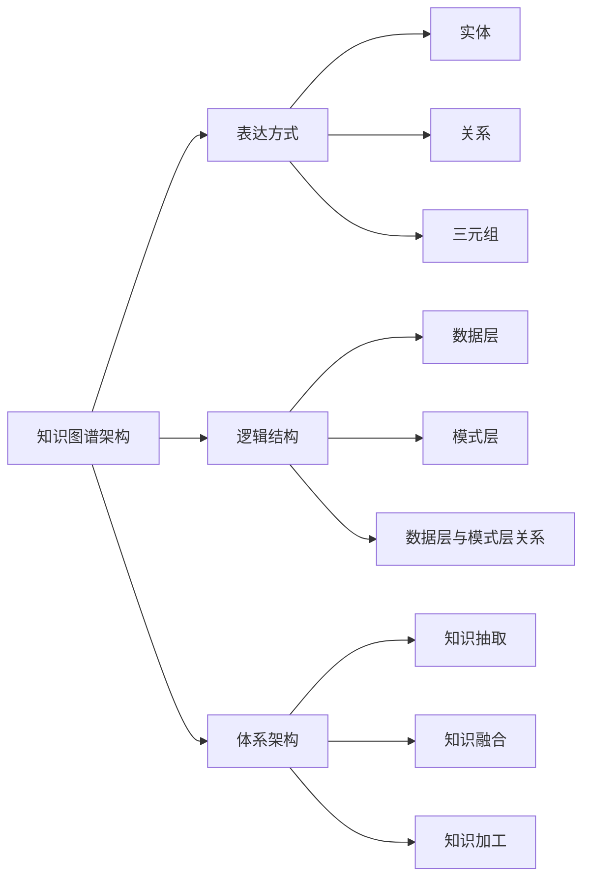

# 知识图谱架构

## 表达方式

三元组是知识图谱的一种通用表示方式，即 G =（E, R, S)，其中 E 是知识库中的实体，R 是知识库中的关系，S 代表知识库中的三元组。

### 实体

实体是知识图谱中的基本元素，代表现实世界中的个体、事物、概念等。每个实体都可以用一个全局唯一的标识符（ID）来唯一确定。实体可以包括人物、地理位置、概念等，是知识图谱中的节点。

### 关系

关系是实体之间的连接，用于描述它们之间的关联和联系。关系可以是有向的，表示连接的方向，也可以是无向的。例如，"父亲"和"母亲"可以是表示两个人之间关系的不同关系类型。

### 三元组

三元组是知识库中的基本信息单元，用来表示实体之间的关系。每个三元组由三部分组成：实体 1、关系、实体 2。这反映了在知识图谱中的实体之间的关联。例如，(人物 A, 父亲, 人物 B) 表示人物 A 是人物 B 的父亲。

## 逻辑结构

知识图谱在逻辑架构上分为两个层次：数据层和模式层。数据层是以事实（fact）为存储单位的图数据库，其事实的基础表达方式就是“实体-关系-实体”或者“实体-属性-属性值”。模式层存储的是经过提炼的知识，借助本体库来规范实体、关系以及实体类型和属性等之间的关系。

### 数据层

> Neo4j, MySQL, MongoDB

数据层是知识图谱中存储实际事实（facts）的部分。这些事实以图数据库的形式存储，其中基本的表达方式是“实体-关系-实体”或者“实体-属性-属性值”。实体表示现实世界中的个体、概念、事件等，关系表示实体之间的联系，而属性和属性值则描述了实体的特征和属性。数据层通常使用图数据库来存储这些关联性数据。图数据库的特点是能够高效地处理实体之间的复杂关系，支持灵活的查询和图形分析。 数据层的内容是对知识图谱中实际现象的实例化，是真实世界中的实体和关系在计算机中的具体表达。模式层中包含了对实体类型、属性、关系等元数据的定义，例如，定义了某个实体类型的属性、属性的数据类型、属性值的范围等。
模式层不仅提供了对实际数据的抽象，还规范了实体、关系和属性的语义，使得知识图谱具有更好的一致性和可理解性。

### 模式层

> RDF/XML, Turtle, OWL/XML, and OBO.

模式层存储的是经过提炼和抽象的知识结构，通过本体库来规范实体、关系、实体类型和属性等之间的关系。模式层定义了知识图谱的基础结构和元信息。本体是一种形式化的、共享的知识模型，用于描述领域中的概念、实体、属性和关系。本体库作为模式层的基础，提供了一种规范化的方式来定义知识图谱中的各个组成部分。

### 数据层与模式层关系

- 数据层的内容是模式层定义的实体、关系和属性的实例。
- 模式层提供了对数据的抽象和规范，使得数据更容易理解、维护和扩展。
- 模式层的更新可能涉及本体的修改，从而影响到数据层中的实例。

综合而言，数据层存储实际的知识图谱数据，而模式层则提供了对这些数据的结构化、抽象和规范化描述，使得知识图谱更具有可理解性和可维护性。两者共同构成了知识图谱的逻辑架构，使得知识能够在计算机中得以表达、管理和应用。

## 体系架构

知识图谱的体系架构分为 3 个部分，分别获取源数据、知识融合和知识计算与知识应用。知识图谱有两种构建方式，自顶向下和自底向下。在知识图谱发展初期，知识图谱主要借助百科类网站等结构化数据源，提取本体和模式信息，加入到知识库的自顶向下方式构建数据库。现阶段知识图谱大多为公开采集数据并自动抽取资源，经过人工审核后加入到知识库中，这种则是自底向上的构建方式。

### 知识抽取

在知识图谱的构建过程中，知识抽取是第一步，旨在从半结构化和无结构数据等异构数据源中获取候选知识单元，抽取实体、关系和实体属性等结构化信息。。关系抽取则通过在文本语料中提取实体之间的关系，构建实体之间的联系。属性抽取从不同信息源中收集特定实体的属性信息，如个人的昵称、生日等。

#### 实体抽取/命名实体识别

> NLTK、Spacy

实体抽取，也称为命名实体识别（named entity recognition，NER），指从源数据中自动识别命名实体，这一步是信息抽取中最基础和关键的部分，因为实体抽取的准确率和召回率对后续知识获取效率和质量影响很大

#### 关系抽取

> OpenIE、RELOD

经过实体抽取, 知识库目前得到的仅是一系列离散的命名实体，关系抽取则通过在文本语料中提取实体之间的关系，构建实体之间的联系。

#### 属性抽取

属性抽取从不同信息源中收集特定实体的属性信息，如个人的昵称、生日等。

### 知识融合

知识融合是对抽取出的信息进行整合，消除冗余和错误，提升知识质量。

#### 实体链接

> BERT、DBpedia Spotlight、AIDA

实体链接是其中的一部分，将抽取出的实体正确链接到知识库中的相应实体。

#### 知识合并

> Ontop、Silk

知识合并则涉及从第三方知识库或已有数据中获取知识输入，包括合并外部知识库和合并关系数据库，以丰富知识图谱的内容。

### 知识加工

知识加工是对抽取和融合得到的基本事实表达进行进一步处理，以构建更为结构化和网络化的知识体系。

#### 本体构建

> RDFS/OWL

本体构建是其中的关键环节，通过规范化的概念建模明确定义概念之间的联系，形成知识概念模板。在知识图谱中，本体位于模式层，用于描述概念层次体系的知识概念模版。

#### 知识推理

> Pellet、HermiT、SWRL

知识推理则是在已有实体关系数据的基础上，通过计算建立新实体关联，从已有知识中发现新知识，拓展知识网络。质量评估是在知识推理阶段对推理得来的知识进行评估，以保证推理结果的质量和可信度。例如已知 (乾隆, 父亲, 雍正) 和 (雍正, 父亲, 康熙) , 可以得到 (乾隆, 祖父, 康熙) 或 (康熙, 孙子, 乾隆)知识推理的对象除了实体关系，还包括实体的属性值、本体概念层次关系等。例如已知 (老虎, 科, 猫科) 和 (猫科, 目, 食肉目) , 可以推出 (老虎, 目, 食肉目) 。

### 相关文章

https://www.cnblogs.com/trunks2008/p/16692231.html
https://www.woshipm.com/pmd/5328539.html
