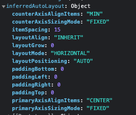

# display

| tranditional | modern                   |
| ------------ | ------------------------ |
| block        | flex, grid               |
| inline       |                          |
| inline-block | inline-flex, inline-grid |

figma 父亲结点 的长度宽度

- fixed
- hug

figma 孩子结点 的长度宽度

- fixed
- full

### flex

如过是 row 的 flex 那么就设置这两个属性

- flex：1
- height：100%

如果是 column 的 flex 那么就设置这两个属性

- flex：1
- width：100%

## 给一个元素添加 CSS 的方法

- HTML
  - style 属性（行内）
  - style 标签（内联）
- CSS
  - css 文件
- JS
  - element.style
  - element.style.cssText
  - element.setAttribute('style', 'cssText')
  - Object.assign(element.style, { cssObject })
  - setProperty('cssName', 'cssValue')
  - styleElement.sheet.insertRule('cssText')
  - styleElement.appendChild(document.createTextNode(styleRule));
  - element.className = 'cssName'
  - element.classList.add('cssName')

## figma 样式与 CSS 样式的映射

| Figma                 | CSS                     |
| --------------------- | ----------------------- |
| width                 | width                   |
| height                | height                  |
| paddingTop            | paddingTop              |
| paddingBottom         | paddingBottom           |
| paddingLeft           | paddingLeft             |
| paddingRight          | paddingRight            |
| topLeftRadius         | borderTopLeftRadius     |
| topRightRadius        | borderTopRightRadius    |
| bottomLeftRadius      | borderBottomLeftRadius  |
| bottomRightRadius     | borderBottomRightRadius |
| strokeTopWeigth       | borderTopWidth          |
| strokeBottomWeigth    | borderBottomWidth       |
| strokeLeftWeigth      | borderLeftWidth         |
| strokeRightWeigth     | borderRightWidth        |
| layoutMode            | display                 |
| layoutSizingHoriantal |                         |
| layoutSizingVertical  |                         |
| counterAxisAlignItems | alignItems              |
| primaryAxisAlignItems | justifyContent          |
| itemSpacing           | gap                     |
| fills                 | background              |
| isAsset               |                         |

### layoutSizingHoriantal、layoutSizingVertical

- FIXED
- HUG
- FILL

### counterAxisAlignItems、primaryAxisAlignItems

- MIN
- CENTER
- MAX
