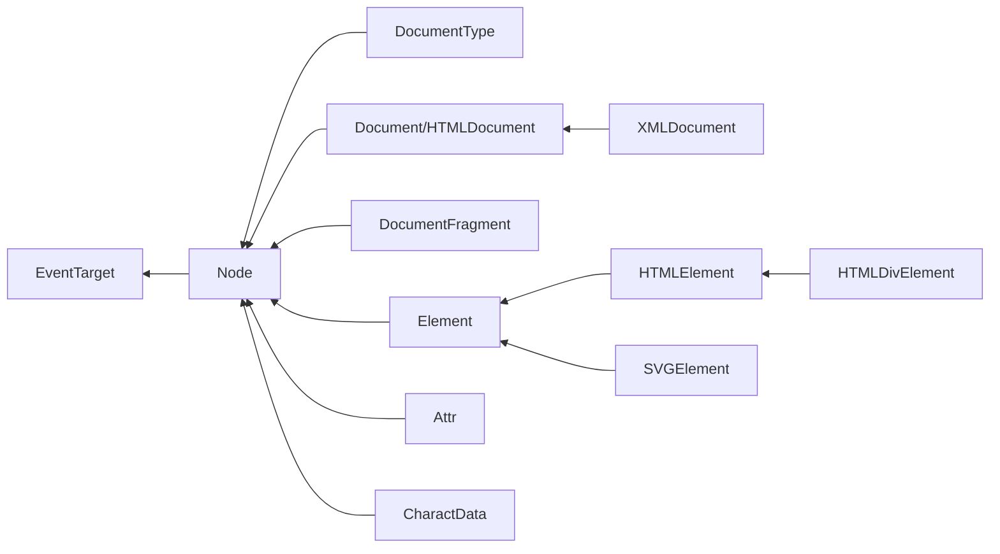
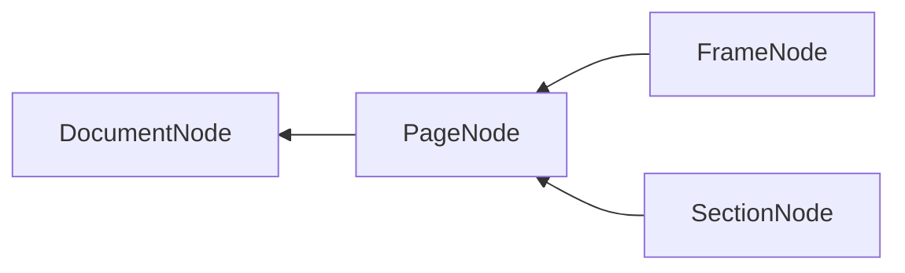

# DOM 数据结构与 Figma 数据结构梳理

## DOM Data Types

### docs

[Node 文档](https://developer.mozilla.org/en-US/docs/Web/API/Node)
[DocumentType 文档](https://developer.mozilla.org/en-US/docs/Web/API/DocumentType)
[Document 文档](https://developer.mozilla.org/en-US/docs/Web/API/Document)
[DocumentFragment 文档](https://developer.mozilla.org/en-US/docs/Web/API/DocumentFragment)
[Element 文档](https://developer.mozilla.org/en-US/docs/Web/API/Element)

## Figma Data Types

FrameNode 是类似于 div 的结点，因为类似像 RectangleNode 这种的结点，是没有 children 属性的，同时在画布的图层结构中也是不可以嵌套存在的
如果需要某种规范的话，那么就是 FrameNode 对应 div
