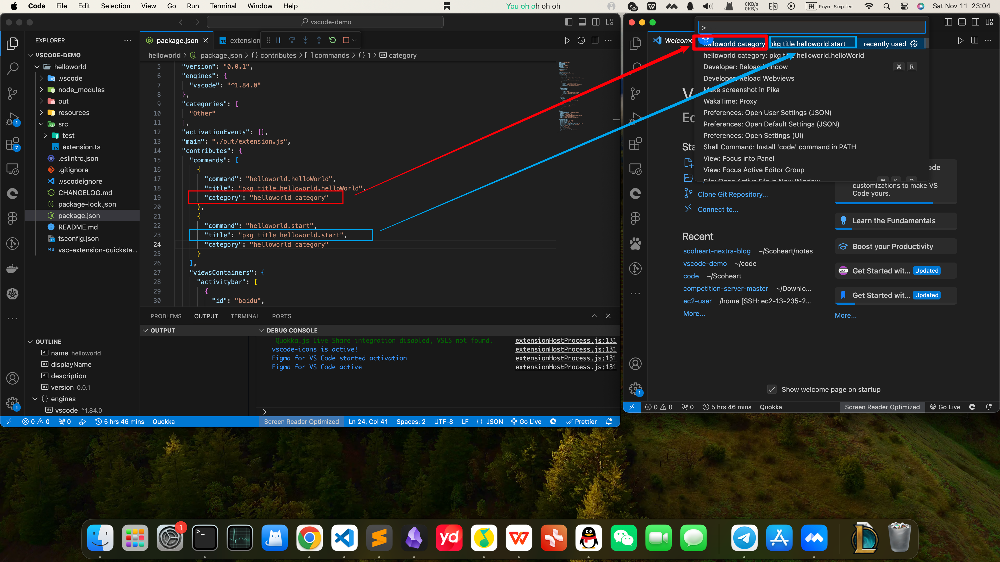

## 给vscode侧边栏添加自定义视图
``` json
 "viewsContainers": {
      "activitybar": [
        {
          "id": "baidu",
          "title": "Baidu Netdisk vscode",
          "icon": "resources/package-explorer.svg"
        }
      ]
    },
    "views": {
      "baidu": [
        {
          "id": "package-dependencies",
          "name": "Dependencies"
        },
        {
          "id": "package-outline",
          "name": "Outline"
        }
      ]
    }
```

